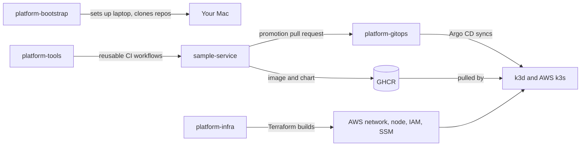

# platform-bootstrap

Sets up a Mac for the platform lab with one command, and holds the map of how every repo fits together.

## Get started

```bash
xcode-select --install   # first time on a new Mac, installs git
mkdir -p ~/lab
cd ~/lab
git clone https://github.com/mjbrian/platform-bootstrap.git ~/lab/platform-bootstrap
cd platform-bootstrap
cp shell/lab.local.zsh.example shell/lab.local.zsh   # set LAB_ACCOUNT_ID
./bootstrap.sh
task aws:login
task doctor
```

Run `task --list` for everything else.

## What lives here

| Path | Purpose |
| --- | --- |
| `Brewfile` | Every CLI tool the lab uses |
| `mise/config.toml` | Global versions of Go, Terraform, kubectl, Helm, Node |
| `colima/` | Docker VM size and type |
| `shell/` | Shell setup, plus an example for personal settings |
| `scripts/` | Single purpose setup and check scripts |
| `Taskfile.yml` | The commands you run |

## How the repos fit together



| Repo | Purpose |
| --- | --- |
| [platform-bootstrap](https://github.com/mjbrian/platform-bootstrap) | Laptop setup and this map |
| [platform-infra](https://github.com/mjbrian/platform-infra) | AWS resources through Terraform |
| [platform-gitops](https://github.com/mjbrian/platform-gitops) | What runs on each cluster, applied by Argo CD |
| [sample-service](https://github.com/mjbrian/sample-service) | A Go service and its Helm chart |
| [platform-tools](https://github.com/mjbrian/platform-tools) | Reusable workflows, CLI, operator, MCP server, templates |

## Rules

New tools go in the Brewfile or a repo's `mise.toml`. Any new laptop settings become part of this configuration.
